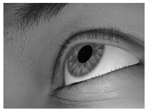
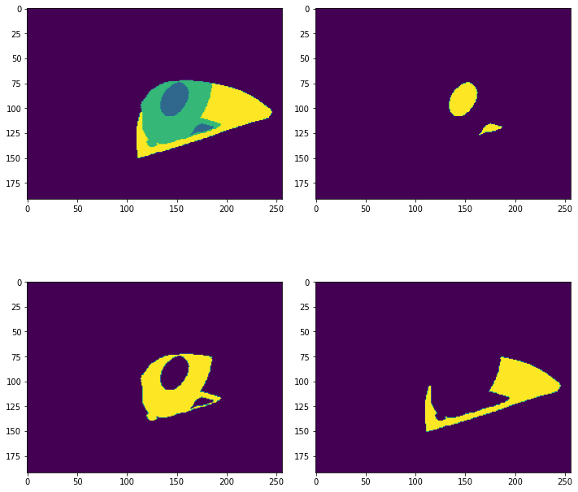

# Replication of RITNet

## About the project
* The source paper and github project of RITNet is here:
  * Source: https://arxiv.org/abs/1910.00694
  * Git: https://github.com/AayushKrChaudhary/RITnet

```
@inproceedings{chaudhary2019ritnet,
  title={RITnet: real-time semantic segmentation of the eye for gaze tracking},
  author={Chaudhary, Aayush K and Kothari, Rakshit and Acharya, Manoj and Dangi, Shusil and Nair, Nitinraj and Bailey, Reynold and Kanan, Christopher and Diaz, Gabriel and Pelz, Jeff B},
  booktitle={2019 IEEE/CVF International Conference on Computer Vision Workshop (ICCVW)},
  pages={3698--3702},
  year={2019},
  organization={IEEE}
}
```

## Requirements:
* Anaconda
* Conda environment with Python 3.8

## Results:
* This is the result trained from 1 epoch of 8000 objects (~34,000 objects in the training set).
<div style="align-item: center;">
  <p>Input:</p>
  
  
  <p>Inference</p>
  
</div>


* Install TensorRT
```
python -m pip install C:\Users\GBURG-4\Documents\TensorRT-7.2.2.3.Windows10.x86_64.cuda-11.1.cudnn8.0\TensorRT-7.2.2.3\graphsurgeon\graphsurgeon-0.4.5-py2.py3-none-any.whl

python -m pip install C:\Users\GBURG-4\Documents\TensorRT-7.2.2.3.Windows10.x86_64.cuda-11.1.cudnn8.0\TensorRT-7.2.2.3\uff\uff-0.6.9-py2.py3-none-any.whl

python -m pip install C:\Users\GBURG-4\Documents\TensorRT-7.2.2.3.Windows10.x86_64.cuda-11.1.cudnn8.0\TensorRT-7.2.2.3\onnx_graphsurgeon\onnx_graphsurgeon-0.2.6-py2.py3-none-any.whl
```